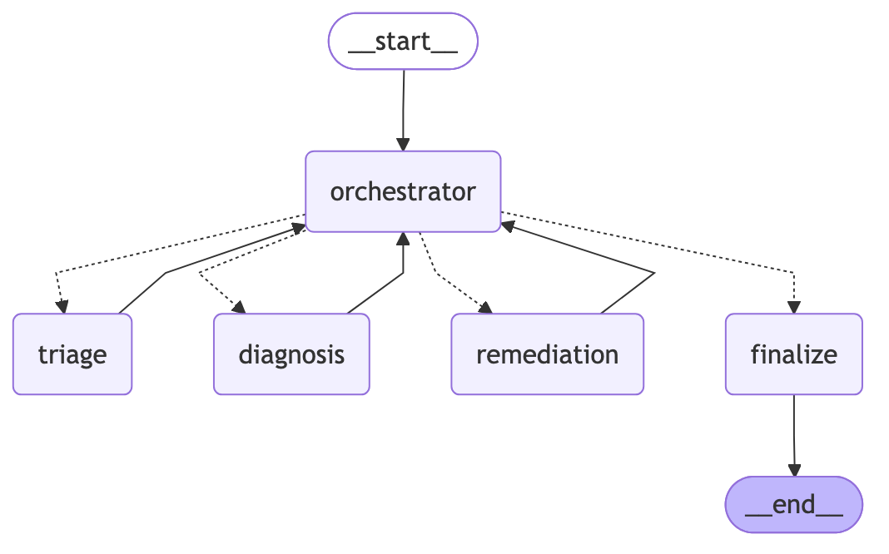

# Agentic AI System Design Report

## Overview

This project implements a multi-agent GPU cluster incident-response system for academic use. The system receives a single alert, decides whether the issue is serious, investigates likely causes, and recommends an action such as monitor only, restart a failed service, drain a node for diagnostics, schedule maintenance, or require manual investigation. The overall approach is a bounded agentic workflow built with LangGraph and LangChain tool-calling patterns: it can reason, consult tools, and recommend actions, but it does not execute infrastructure changes directly.

The design uses a prompt-driven orchestrator so routing is determined by shared incident state and prompt instructions rather than a fixed rule tree alone. Deterministic policy enforcement still exists after agent decisions are returned, because infrastructure safeguards should not depend only on model compliance. This hybrid design follows common agentic patterns in which language-model reasoning is paired with explicit tool use and control logic (Yao et al., 2023; Schick et al., 2023).

## Task and Use Case Description

The task is GPU cluster incident response. The use case is an operational setting in which a single infrastructure alert arrives and an agentic system helps a human operator decide what to do next. The system is responsible for classifying severity, investigating likely root cause, estimating operational impact, and recommending a constrained remediation path. It is not responsible for directly draining nodes, restarting services in production, or terminating hardware. That boundary is intentional because the project focuses on reasoning, tool use, memory, and safeguards rather than autonomous infrastructure control.

## Agent Architecture and Workflow Design

The architecture has four roles. The orchestrator decides which stage should run next based on current state. The triage agent acts as the first responder and classifies severity and category. The diagnosis agent investigates root cause using telemetry, jobs, and a knowledge base. The remediation agent recommends the safest action and then passes through a deterministic safeguard layer that can override the recommendation when policy requires it.

The workflow is implemented as a compiled LangGraph state machine with the path `orchestrator -> triage -> diagnosis -> remediation -> finalize`, plus routing back through the orchestrator after each agent stage. The executable architecture source is generated directly by `agentic_system.py` as `outputs/langgraph_workflow.mmd`, so the diagram artifact comes from the compiled LangGraph workflow rather than a separately maintained drawing (LangChain, n.d.).

## Persona, Reasoning, and Decision Logic

Each agent has a distinct operational persona. The orchestrator behaves like a workflow supervisor deciding what stage should happen next. The triage agent behaves like a first responder deciding whether the signal is transient, workload-related, or serious enough to escalate. The diagnosis agent behaves like a root-cause analyst that correlates telemetry, workload context, and known issue patterns. The remediation agent behaves like a cautious operations planner that recommends the least risky next step and then yields to hard safeguards where policy requires it.

Reasoning is distributed across the workflow rather than placed in one large prompt. The orchestrator proposes a route based on shared state, but Python still enforces minimal routing constraints when the proposed route conflicts with the workflow state. The triage agent reasons about severity and escalation. The diagnosis agent reasons about plausible causes and confidence. The remediation agent reasons about the safest action, then the policy layer checks whether that action is permissible. This separation keeps the model responsible for judgment over context while keeping final control over safety boundaries in deterministic code.

## Tool Use and Memory Design

The system uses several explicit components that support tool use and memory. Persona and role prompts are stored in Markdown files for the orchestrator, triage, diagnosis, and remediation agents. A shared incident state object stores the normalized alert, tool context, cross-incident memory, audit trail, reasoning chain, tool calls, and final outputs. LangChain tools marked with the `@tool` decorator provide telemetry lookup, knowledge-base search, blast-radius checks, maintenance-window checks, and remediation-template lookup. External JSON data files provide knowledge-base entries, policies, remediation templates, sample alerts, and host-specific node profiles.

Tool use is specialized by stage. The triage agent uses `lookup_alert_history(node_id)` and `check_node_status(node_id)` before producing a severity and category. The diagnosis agent uses `get_gpu_error_details(node_id)`, `get_running_jobs(node_id)`, and `search_knowledge_base(query)` to form a root-cause hypothesis and confidence score. The remediation agent uses `draft_remediation_plan(action_type, node_id)`, `check_blast_radius(node_id)`, and `check_maintenance_window()` to select a response plan. The tool-calling loop follows a reason-and-act pattern in which the model must gather evidence before returning a structured decision, which reduces the chance that it relies only on prompt priors (Yao et al., 2023; Schick et al., 2023).

Memory matters in two ways. First, the shared incident state persists information across orchestration, triage, diagnosis, remediation, and finalization. Second, cross-incident memory stored in the node profiles allows the agent to reason about recurrence patterns. For example, XID 63 is often benign in isolation, but repeated XID 63 alerts on the same node should raise concern about degradation.

## Evaluation of Agent Behavior

Observed behavior in this project should be interpreted as behavior over simulated operational evidence rather than over live infrastructure data. That distinction matters because the goal of the artifact is to demonstrate agent architecture, reasoning flow, tool use, memory, and safeguards under realistic incident patterns, not to claim that the system has been validated against production telemetry. The simulated alerts, node profiles, blast-radius estimates, maintenance windows, and knowledge-base matches were designed to resemble real GPU operations signals closely enough that the agent has to reason through plausible tradeoffs.

Within that simulated environment, the workflow behaved in ways that are consistent with how a human operator would be expected to think through similar incidents in practice. A clear XID 48 alert on `gpu-node-042` escalates as a high-severity hardware case and leads toward drain-and-diagnose reasoning. A GPU utilization drop on `gpu-node-017` remains non-disruptive because the surrounding workload context suggests normal preprocessing behavior rather than an infrastructure fault. A recurring XID 63 pattern on `gpu-node-088` shows why memory matters: although one row-remapping event may be informational, repeated events on the same node should increase concern about degradation. An XID 79 alert on `gpu-node-005` produces a serious diagnosis but still encounters policy friction because the simulated node is busy during peak hours. A localized service failure on `gpu-host-demo-001` stays narrowly scoped and supports a `RESTART_PROCESS` recommendation instead of a broader host-level action.

The important observation is not that these exact outputs are operationally true, because the underlying evidence is synthetic. The more important observation is that the workflow follows a defensible incident-response thought process: gather context first, distinguish workload issues from infrastructure issues, use recurrence patterns to refine severity, and apply safety policy before recommending disruption. In a real environment, the same reasoning pattern would still be useful, but the confidence in the result would depend on the quality, freshness, and completeness of the live telemetry sources feeding the tools.

## Ethical and Responsible Use Considerations

The central ethical issue is accountability. Infrastructure recommendations can interrupt jobs, waste compute time, and affect multiple users sharing a cluster. For that reason, the system does not grant itself permission to execute disruptive actions. High-impact steps either require explicit human approval or are converted into safer alternatives such as scheduled maintenance or manual investigation. This reduces the risk that operators defer blindly to a model without reviewing the evidence (NIST, 2023).

There is also an over-trust risk. If users assume the diagnosis is always correct, they may treat a plausible recommendation as ground truth. The design tries to counter that by exposing confidence, evidence, tool outputs, and safeguards instead of returning only a final action label.

Fairness and consistency also matter. Blast-radius and scheduling policies should not systematically disadvantage one user group or workload type without justification. In a production version, those thresholds would need regular review so that shared infrastructure policies remain operationally sound and equitable.

## Limitations, Risks, and Safeguards

The workflow includes several explicit safeguards. A severity gate auto-resolves low-severity incidents after triage. A confidence threshold forces `MANUAL_INVESTIGATION` when the diagnosis confidence falls below `0.6`. A blast-radius threshold requires human approval when a disruptive action would affect more than ten jobs. A peak-hours safeguard requires human approval or delays disruptive remediation during business hours. A rate-limit safeguard blocks repeated disruptive actions if recent memory shows too many similar actions in the current window. Every remediation template also includes a rollback plan, and the runtime raises an error if a chosen template lacks one.

These safeguards are implemented in Python after the agent proposes an action. That separation is deliberate. The model is responsible for reasoning over context and choosing a likely action, while the policy layer is responsible for enforcing safety boundaries consistently. This kind of bounded autonomy improves controllability and aligns with guidance that AI systems affecting operational decisions should have explicit constraints, human oversight points, and traceable behavior (NIST, 2023).

Transparency is handled through several saved artifacts. Each run produces a human-readable incident report, an `audit_trail`, a `reasoning_chain`, structured `tool_invocations`, and a `message_log` that captures prompt, tool, and response summaries. By default, the CLI prints these events live so an operator can see the workflow progress instead of waiting on silent execution.

The main limitations follow directly from the system design. Because all data is simulated, the project cannot demonstrate integration issues that often dominate real AIOps work, such as stale metrics, missing signals, conflicting dashboards, delayed scheduler state, noisy alerts, or incomplete incident history. The blast-radius and maintenance-window outputs are also idealized; in production, those values would often require joining multiple operational systems and could change while the workflow is running. The fallback default node profile keeps the system usable for unknown hosts, but in a real deployment that same fallback would need to be treated cautiously because generic context can make a recommendation appear more certain than the evidence justifies.

There are also limitations specific to model-driven reasoning. The quality of the final recommendation still depends on prompt adherence, tool-use discipline, and model quality. Even with structured outputs and post-decision safeguards, the system can only be as reliable as the evidence it is given and the consistency with which it interprets that evidence. For that reason, the workflow is recommendation-only. That is a limitation in terms of operational automation, but it is also an intentional design choice: with simulated data, it is appropriate to evaluate reasoning quality and safety boundaries without claiming readiness for autonomous remediation on real infrastructure.

## Future Improvements

The most important next step is live integration with operational systems. The current tool interfaces are already shaped around telemetry, job context, and maintenance data, so they could be connected to real sources while preserving the current agent design.

Another improvement would be stronger evaluation. The sample alert library could grow into a replay suite with expected outcomes so prompt or policy changes can be regression tested. Additional cases for cascading failures, cluster-wide NCCL incidents, and ambiguous multi-signal alerts would make the workflow more robust.

The system could also benefit from longer-lived memory with retention controls. Right now memory is simulated per host profile. A production version would need durable storage, retention limits, and access controls so incident history remains useful without collecting more operational data than necessary.

## For Non-Technical Readers

This project acts like a digital operations assistant for a GPU cluster. When an alert appears, it reviews the health of the affected machine, checks whether active jobs may be impacted, and recommends the safest next step for a human operator. The system does not directly drain nodes, restart services, or terminate hardware on its own. Instead, it explains what it found, records an audit trail, and highlights when a person must approve a disruptive action. The goal is to speed up incident review while keeping important decisions visible and controlled.

## References

LangChain. (n.d.). *LangGraph documentation*.

National Institute of Standards and Technology. (2023). *AI risk management framework (AI RMF 1.0)*. U.S. Department of Commerce.

Schick, T., Dwivedi-Yu, J., Dessi, R., Raileanu, R., Lomeli, M., Hambro, E., Zettlemoyer, L., Cancedda, N., & Scialom, T. (2023). *Toolformer: Language models can teach themselves to use tools*.

Yao, S., Zhao, J., Yu, D., Du, N., Shafran, I., Narasimhan, K., & Cao, Y. (2023). *ReAct: Synergizing reasoning and acting in language models*.
