# Agentic AI System Design Report

## Overview

The agentic task is GPU cluster incident response. The system receives a single alert, decides whether the issue is serious, investigates likely causes, and recommends an action such as monitor only, restart a failed service, drain a node for diagnostics, schedule maintenance, or require manual investigation. The overall approach is a multi-agent workflow with one orchestrator and three specialist agents, implemented with LangGraph and LangChain tool-calling patterns. The workflow is bounded: it can reason, consult tools, and recommend actions, but it does not execute infrastructure changes directly.

The design uses a prompt-driven orchestrator so routing is determined by shared incident state and prompt instructions rather than a fixed rule tree alone. Deterministic policy enforcement still exists after agent decisions are returned, because infrastructure safeguards should not depend only on model compliance. This hybrid design follows common agentic patterns in which language-model reasoning is paired with explicit tool use and control logic (Yao et al., 2023; Schick et al., 2023).

## System Architecture and Design

The architecture has four roles. The orchestrator decides which stage should run next based on current state. The triage agent acts as the first responder and classifies severity and category. The diagnosis agent investigates root cause using telemetry, jobs, and a knowledge base. The remediation agent recommends the safest action and then passes through a deterministic safeguard layer that can override the recommendation when policy requires it.

The workflow is implemented as a compiled LangGraph state machine with the path `orchestrator -> triage -> diagnosis -> remediation -> finalize`, plus routing back through the orchestrator after each agent stage. The executable architecture source is generated directly by `agentic_system.py` as `outputs/langgraph_workflow.mmd`, so the diagram artifact comes from the compiled LangGraph workflow rather than a separately maintained drawing (LangChain, n.d.).

The system uses several explicit components:

1. Persona and role prompts stored in Markdown files for the orchestrator, triage, diagnosis, and remediation agents.
2. A shared incident state object that stores the normalized alert, tool context, cross-incident memory, audit trail, reasoning chain, tool calls, and final outputs.
3. LangChain tools marked with the `@tool` decorator for telemetry lookup, knowledge-base search, blast-radius checks, maintenance-window checks, and remediation-template lookup.
4. External JSON data files for knowledge-base entries, policies, remediation templates, sample alerts, and host-specific node profiles.

## Decision Logic and Behavior

The triage agent uses `lookup_alert_history(node_id)` and `check_node_status(node_id)` before producing a structured severity and category. Its job is to decide whether the alert is likely transient, workload-related, or serious enough to escalate. Cross-incident memory can change the classification. For example, XID 63 is often benign in isolation, but repeated XID 63 alerts on the same node should raise concern about degradation.

The diagnosis agent uses `get_gpu_error_details(node_id)`, `get_running_jobs(node_id)`, and `search_knowledge_base(query)` to form a root-cause hypothesis and confidence score. This lets the system correlate telemetry with known NVIDIA-style failure patterns and with workload context. The diagnosis stage follows a reason-and-act pattern: the model is required to gather tool outputs before returning a final explanation, which reduces the chance that it relies only on prompt priors (Yao et al., 2023; Schick et al., 2023).

The remediation agent uses `draft_remediation_plan(action_type, node_id)`, `check_blast_radius(node_id)`, and `check_maintenance_window()` to select a response plan. It can recommend `RESTART_PROCESS` for localized service failures, `DRAIN_AND_DIAGNOSE` for clear node hardware faults, `SCHEDULE_MAINTENANCE` when safety policy blocks an immediate drain, `TAG_AND_TERMINATE` for severe hardware quarantine cases, and `MANUAL_INVESTIGATION` when confidence is too low or when a safeguard blocks automation.

## Safety, Reliability, and Transparency

The workflow includes several explicit safeguards. A severity gate auto-resolves low-severity incidents after triage. A confidence threshold forces `MANUAL_INVESTIGATION` when the diagnosis confidence falls below `0.6`. A blast-radius threshold requires human approval when a disruptive action would affect more than ten jobs. A peak-hours safeguard requires human approval or delays disruptive remediation during business hours. A rate-limit safeguard blocks repeated disruptive actions if recent memory shows too many similar actions in the current window. Every remediation template also includes a rollback plan, and the runtime raises an error if a chosen template lacks one.

These safeguards are implemented in Python after the agent proposes an action. That separation is deliberate. The model is responsible for reasoning over context and choosing a likely action, while the policy layer is responsible for enforcing safety boundaries consistently. This kind of bounded autonomy improves controllability and aligns with guidance that AI systems affecting operational decisions should have explicit constraints, human oversight points, and traceable behavior (NIST, 2023).

Transparency is handled through several saved artifacts. Each run produces a human-readable incident report, an `audit_trail`, a `reasoning_chain`, structured `tool_invocations`, and a `message_log` that captures prompt, tool, and response summaries. By default, the CLI prints these events live so an operator can see the workflow progress instead of waiting on silent execution.

## Observed Behavior and Limitations

Representative sample alerts cover several different behaviors. A clear XID 48 alert on `gpu-node-042` should escalate as a P1 hardware incident and recommend draining the node for diagnostics. A GPU utilization drop on `gpu-node-017` should stay in the low-severity path because the job profile indicates expected CPU-heavy preprocessing. A recurring XID 63 alert on `gpu-node-088` should show that cross-incident memory matters: the repetition pattern raises concern even though the single alert type is often informational. An XID 79 alert on `gpu-node-005` should diagnose a serious hardware issue but still require human approval because the node is busy during peak hours and exceeds the blast-radius threshold. A service-failure alert on `gpu-host-demo-001` should stay localized and prefer `RESTART_PROCESS` rather than disruptive node action.

These runs show the intended behavior of the system. The workflow investigates aggressively when telemetry supports a real node problem, but it avoids unnecessary disruption when the evidence points to expected workload behavior or to a localized daemon failure. The interactive alert loop and the non-interactive CLI both trigger the same full workflow, so the observed behavior remains consistent across entry points.

The system still has important limitations. All telemetry is simulated, not pulled from live systems such as DCGM, Slurm, Grafana, or a ticketing platform. The quality of the final recommendation depends on prompt adherence and model quality. The fallback default node profile keeps the CLI usable, but it also means unknown hosts may receive conservative but less precise recommendations than known hosts. The workflow is also recommendation only; it stops before closed-loop remediation, which is safer for this project but limits operational capability.

## Ethical and Responsible Use Considerations

The central ethical issue is accountability. Infrastructure recommendations can interrupt jobs, waste compute time, and affect multiple users sharing a cluster. For that reason, the system does not grant itself permission to execute disruptive actions. High-impact steps either require explicit human approval or are converted into safer alternatives such as scheduled maintenance or manual investigation. This reduces the risk that operators defer blindly to a model without reviewing the evidence (NIST, 2023).

There is also an over-trust risk. If users assume the diagnosis is always correct, they may treat a plausible recommendation as ground truth. The design tries to counter that by exposing confidence, evidence, tool outputs, and safeguards instead of returning only a final action label.

Fairness and consistency also matter. Blast-radius and scheduling policies should not systematically disadvantage one user group or workload type without justification. In a production version, those thresholds would need regular review so that shared infrastructure policies remain operationally sound and equitable.

## Future Improvements

The most important next step is live integration with operational systems. The current tool interfaces are already shaped around telemetry, job context, and maintenance data, so they could be connected to real sources while preserving the current agent design.

Another improvement would be stronger evaluation. The sample alert library could grow into a replay suite with expected outcomes so prompt or policy changes can be regression tested. Additional cases for cascading failures, cluster-wide NCCL incidents, and ambiguous multi-signal alerts would make the workflow more robust.

The system could also benefit from longer-lived memory with retention controls. Right now memory is simulated per host profile. A production version would need durable storage, retention limits, and access controls so incident history remains useful without collecting more operational data than necessary.

## For Non-Technical Readers

This project acts like a digital operations assistant for a GPU cluster. When an alert appears, it reviews the health of the affected machine, checks whether active jobs may be impacted, and recommends the safest next step for a human operator. The system does not directly drain nodes, restart services, or terminate hardware on its own. Instead, it explains what it found, records an audit trail, and highlights when a person must approve a disruptive action. The goal is to speed up incident review while keeping important decisions visible and controlled.

## References

LangChain. (n.d.). *LangGraph documentation*.

National Institute of Standards and Technology. (2023). *AI risk management framework (AI RMF 1.0)*. U.S. Department of Commerce.

Schick, T., Dwivedi-Yu, J., Dessi, R., Raileanu, R., Lomeli, M., Hambro, E., Zettlemoyer, L., Cancedda, N., & Scialom, T. (2023). *Toolformer: Language models can teach themselves to use tools*.

Yao, S., Zhao, J., Yu, D., Du, N., Shafran, I., Narasimhan, K., & Cao, Y. (2023). *ReAct: Synergizing reasoning and acting in language models*.
