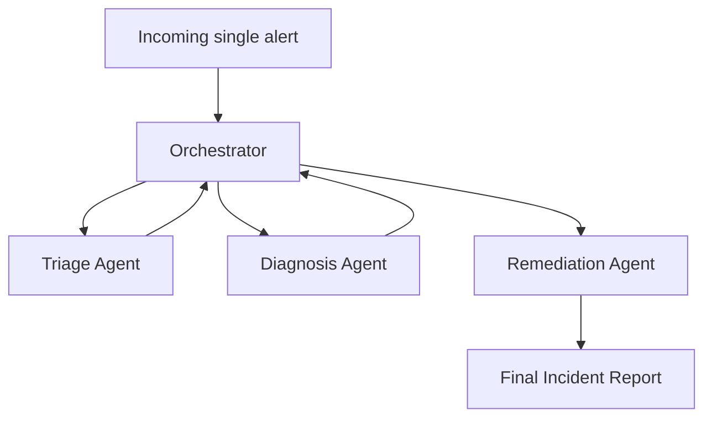

# Agentic AI System Design Report Outline

## Overview

- Define the agentic task: incident triage, diagnosis, and remediation planning for GPU cluster alerts.
- State the system goal: reduce time-to-triage while preserving operator control for disruptive infrastructure actions.
- Explain the chosen approach: a prompt-driven multi-agent workflow implemented in LangGraph with file-backed tools and Pydantic-validated sample data.
- Clarify boundaries: the system recommends actions and logs an audit trail, but it does not directly execute drains, restarts, or hardware changes.

## System Architecture and Design

- Describe the four core roles:
  - Orchestrator agent: reads shared incident state and routes the next step using a prompt.
  - Triage agent: classifies severity and category using alert history and node status tools.
  - Diagnosis agent: forms a root-cause hypothesis using detailed GPU telemetry, running jobs, and the knowledge base.
  - Remediation agent: recommends the safest action using remediation templates, blast-radius data, maintenance windows, and policy constraints.
- Reference the implementation files:
  - `agentic_system.py`
  - `models.py`
  - `prompts/orchestrator.md`
  - `prompts/triage_agent.md`
  - `prompts/diagnosis_agent.md`
  - `prompts/remediation_agent.md`
  - `data/alert_prompts.json`
  - `data/node_profiles.json`
  - `data/knowledge_base.json`
  - `data/policies.json`
  - `data/remediation_templates.json`
- Add a Mermaid architecture description for the report or notebook:

- Explain the design tradeoff:
  - Prompt-driven routing and reasoning increase agent realism.
  - Explicit policy enforcement in code keeps safety checks deterministic.
  - Pydantic models keep validation readable and close to the runtime code.

## Decision Logic and Behavior

- Triage logic:
  - Uses node history, current telemetry, and cross-incident memory to classify the alert.
  - Elevates recurring patterns such as repeated XID 63 events.
  - Can auto-resolve low-severity or clearly non-infrastructure incidents.
- Diagnosis logic:
  - Correlates XID codes, ECC counters, job context, and knowledge-base matches.
  - Produces a root-cause hypothesis and a bounded confidence score.
  - Flags uncertainty rather than overstating conclusions.
- Remediation logic:
  - Selects an action template and fills in node-specific impact context.
  - Applies explicit safeguards after the LLM recommendation.
  - Ensures every disruptive recommendation includes rollback guidance.
- Orchestrator logic:
  - Reads current state and uses the orchestrator prompt to route the workflow.
  - Revisits the orchestrator after each agent so the route is determined from shared context rather than a fixed linear script.

## Safety, Reliability, and Transparency

- Severity gate:
  - P3 and P4 incidents auto-resolve with logging.
  - P1 and P2 incidents can proceed to diagnosis.
- Blast-radius check:
  - Actions affecting more than the policy threshold require human approval.
- Peak-hours protection:
  - Disruptive drain-like actions during business hours require human approval and can be shifted to the next maintenance window.
- Rate limiting:
  - More than two drain actions in one hour is blocked to avoid cascade behavior.
- Confidence threshold:
  - If diagnosis confidence is below `0.6`, the workflow forces manual investigation.
- Transparency:
  - Every step writes audit entries and reasoning summaries into the incident state and final report.
- Reliability features:
  - All sample input files are validated with Pydantic models before execution.
  - Prompt text lives outside Python so prompt revisions do not require code changes.

## Observed Behavior and Limitations

- Sample alert 1: Clear hardware failure
  - Expected behavior: P1 hardware classification, high-confidence diagnosis, drain-and-diagnose recommendation.
- Sample alert 2: Ambiguous utilization drop
  - Expected behavior: treat the alert as workload behavior, auto-resolve, and avoid unnecessary disruption.
- Sample alert 3: Recurring XID 63
  - Expected behavior: use cross-incident memory to raise severity beyond a single-event interpretation.
- Sample alert 4: Peak-hours XID 79
  - Expected behavior: confirm severe hardware risk but require human approval because of policy constraints.
- Sample alert 5: Critical service failure
  - Expected behavior: recommend `RESTART_PROCESS` rather than a disruptive node action.
- Limitation discussion points:
  - Final behavior still depends on model quality and prompt adherence.
  - Sample data is realistic but simulated, so it cannot capture every cluster edge case.
  - The system recommends actions but does not validate them against live schedulers, DCGM, or ticketing systems.
- Failure-case emphasis:
  - The utilization-drop prompt is the key false-positive case demonstrating that the system can decide not to act.

## Ethical and Responsible Use Considerations

- Accountability:
  - Autonomous infrastructure recommendations can affect user jobs, deadlines, and shared compute availability.
- Human oversight:
  - Human approval is required for high-impact or peak-hours disruption.
- Transparency:
  - Auditability is necessary so operators can review why the system suggested an action.
- Misuse risk:
  - An overly trusted agent could normalize automated disruption without sufficient review.
- Bias and fairness:
  - Blast-radius logic should not systematically favor one user group or workload type without documented policy.

## Future Improvements

- Add live integrations for DCGM, scheduler APIs, and ticketing systems behind the same tool interface.
- Introduce stronger evaluator prompts or automated checks for prompt-output consistency.
- Expand sample alert coverage for systemic failures, NCCL issues, and multi-node incidents.
- Add persistent long-term memory across runs rather than using only host-profile memory snapshots.
- Add offline test fixtures that replay captured production telemetry samples after sanitization.

## References

- ReAct
  - Yao, S., Zhao, J., Yu, D., Du, N., Shafran, I., Narasimhan, K., and Cao, Y. (2023). *ReAct: Synergizing Reasoning and Acting in Language Models.*
- LangGraph
  - LangChain. *LangGraph Documentation.*
- Tool-use patterns
  - Schick, T., Dwivedi-Yu, J., Dessi, R., Raileanu, R., Lomeli, M., Hambro, E., Zettlemoyer, L., Cancedda, N., and Scialom, T. (2023). *Toolformer: Language Models Can Teach Themselves to Use Tools.*
- Responsible AI and governance
  - Add one course-approved or instructor-approved citation tying safeguards and oversight to agentic system governance.

## Appendix Notes

- Include screenshots or pasted excerpts from representative sample-alert outputs.
- Reference the notebook artifact for observed behavior:
  - `agentic_system.ipynb`
- Reference the saved outputs directory if included in the submission:
  - `outputs/`
